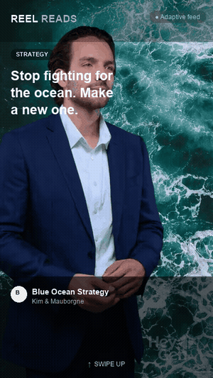

# Reel Reads

**Same dopamine as TikTok. Opposite outcome.**

Reel Reads is a concept for a video-native, swipe-first feed where every card is a 20-second idea distilled from a book. It was built as a final-project pitch for the INSEAD Gen AI course (2026), but the thesis is genuinely product-shaped: redirect an existing compulsive behaviour (doomscrolling) toward an outcome that compounds instead of rotting attention.

## The idea

People don't need to be told to scroll less. The habit isn't the problem, the content is: it leaves nothing behind. Reel Reads keeps the mechanic (infinite vertical swipe, short-form video, a feed that learns you) and changes the payload to a book idea instead of a 15-second distraction.

Each card has two video layers:
- an **ambient motion background**, themed to the idea, that keeps the feed alive
- an **AI author-explainer clip**: a short, clearly labelled AI narration of the author delivering the idea in their own words

## The wedge

Book-summary apps already exist (Blinkist, Headway, Shortform) and swipeable book-card apps already exist (LeafTok). None of them have a real recommender. Reel Reads' differentiator isn't the card, it's the **feed**: an adaptive recommender that reorders what you see next based on what you dwell on, swipe past, or save, the same mechanic that makes TikTok's For You page work, pointed at a different payload.

**Beachhead:** MBA students and the business-school community, defined, reachable, carrying long reading lists, and already fluent in short-form video.

## What's in this repo

| Path | What it is |
| --- | --- |
| `mockup/` | A self-contained, clickable HTML mockup of the feed (real AI-generated author video on the first card, ambient canvas motion on the rest) |
| `screenshots/` | Static captures of the mockup |
| `Docs/` | The working specification set: product spec, design system, and build/implementation strategy |

### Try the mockup

Open `mockup/reel-reads-mockup.html` in a browser, or view it live here: **[Reel Reads — feed mockup](https://claude.ai/code/artifact/43ca6461-fa73-4832-b745-e03a663a5548)**

## Design language

Deliberately not a neon TikTok clone. The visual argument ("same dopamine, opposite outcome") is made before a word is read: a quiet-luxury editorial feel, deep forest green, warm golden-hour imagery, a confident serif for the idea-hooks, generous whitespace. Reference direction: [legora.com](https://legora.com)'s aesthetic language, not its layout.

## Status

This is a pitch-stage concept, not a shipped product. Built so far: product specification, seed book catalogue, design system, and a working clickable mockup with one real AI-narrated author clip. Not yet built: the pitch deck, the 1-pager, the full pitch video, and the recommender notebook (an offline proof of an atomiser + adaptive taste-vector recommender, scored by adaptive-vs-random uplift).

## Author

Built by [Arthur](https://github.com/Arthurmf01), MBA26D at INSEAD.
